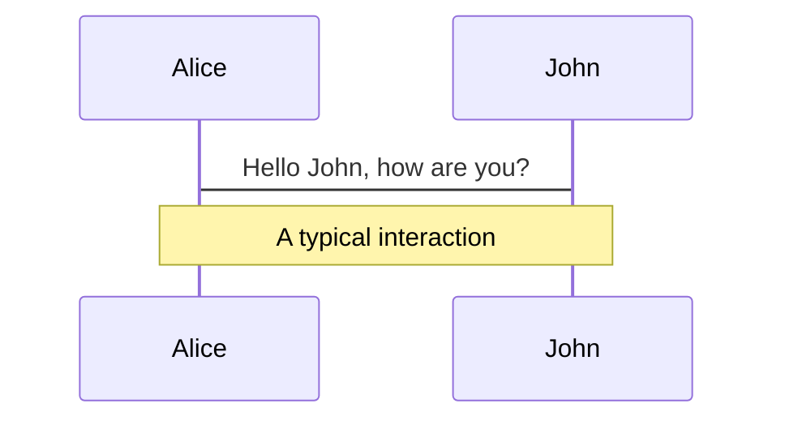
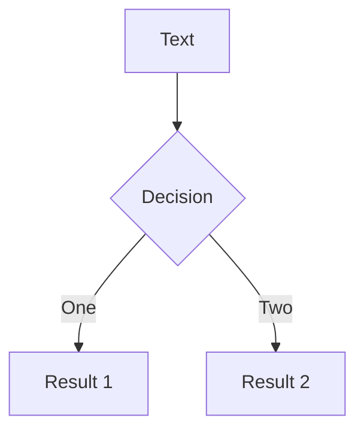
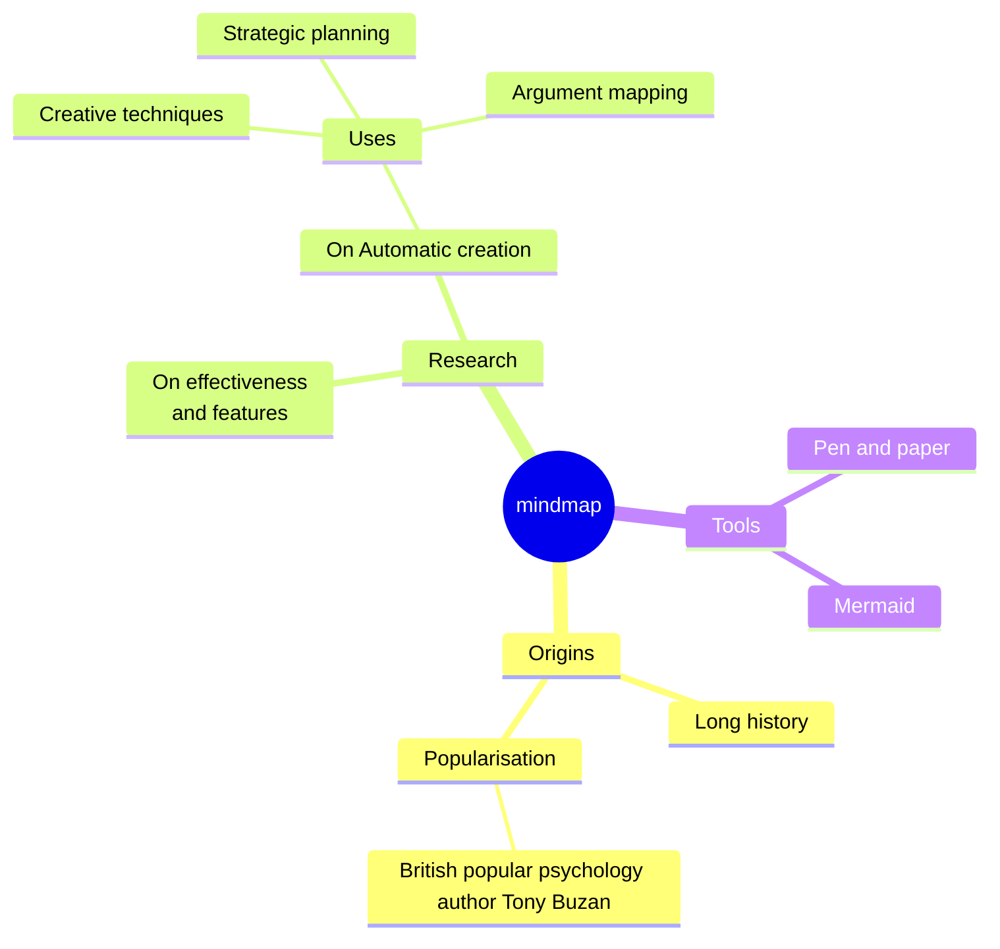
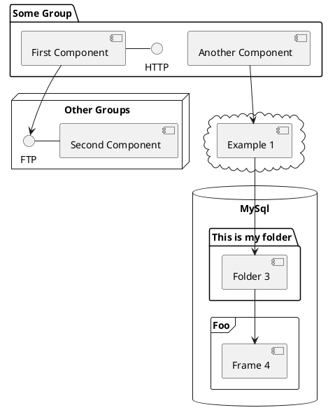

# Diagrams

You can create diagrams / graphs from textual descriptions, directly in your Markdown.

Learn more: [Mermaid Diagrams](https://sli.dev/features/mermaid) and [PlantUML Diagrams](https://sli.dev/features/plantuml)
